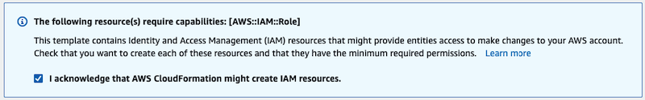
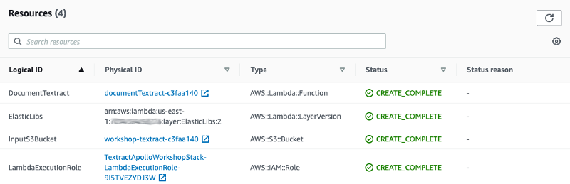
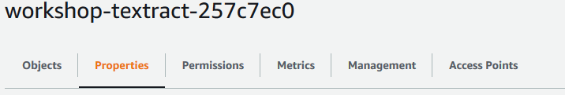
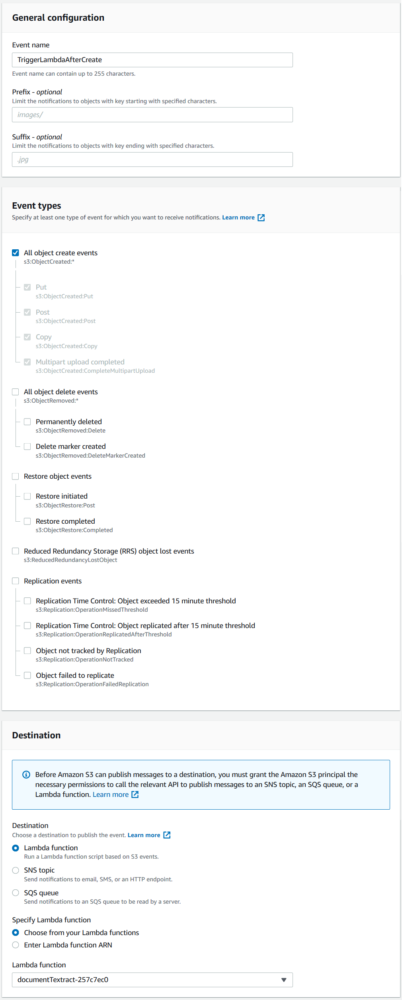
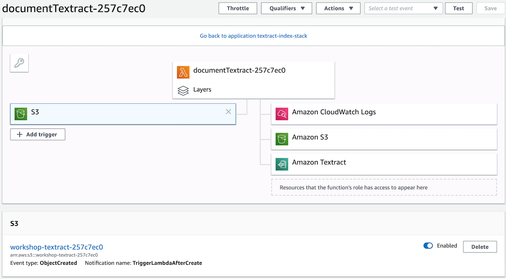

[<<<< Back to workshop](../README.md)

# LAB 0 - Setup the environment

## AWS Cloudformation

AWS Cloudformation provides the ability to describe and provision the infrastucture resources on AWS. Thanks to template files (Infrastructure as code), we will deploy 'Stacks' (a stack is a set of resources that work together to achieve something).

To setup the initial environment, click on launch stack button with your prefered region:

Region | Button
------------ | -------------
us-east-1 | 
eu-west-1 | 
ap-southeast-1 | 

- In step 1, we'll use a template already available in Amazon S3. just click **Next** in the bottom.
- In step 2, provide a name to your stack. We don't have any parameters. Click **Next** in the bottom.
- In step 3, we don't need to fill anything, just click **Next** in the bottom.
- Finally in step 4, you can review everything and check the box **"I acknowledge that AWS CloudFormation might create IAM resources."** and click **Create stack**.

Wait a minute to let Cloudformation create your resources (you can refresh the Events to see the evolution).

Once it's done, you can see all resources created by the CloudFormation stack in [AWS CloudFormation Console](https://console.aws.amazon.com/cloudformation/home). You should get the following ressources:

- *DocumentTextract* is the AWS Lambda function that will get called when a file is uploaded in the *InputS3Bucket*. 
- *LambdaExecutionRole* is an IAM Role that provides the permissions to use Cloudwatch (logs), S3 and Textract for the Lambda.
- *ElasticLibs* is a set of dependencies we'll use in Lab 3 to manipulate Elasticsearch.

## Complete the setup
In order to trigger the process when a document is uploaded in S3, we need to configure an event notification for the ingestion bucket ([doc](https://docs.aws.amazon.com/AmazonS3/latest/user-guide/enable-event-notifications.html)):

1. In [S3 console](https://s3.console.aws.amazon.com/s3/buckets/), click on your *workshop-textract-xyz* bucket, then select the "Properties" tab:

  

2. Scroll down to "Advanced settings" and choose "Events", choose "Add notification" and then fill as follow. Thus, each time an object is created, the lambda function will be triggered:

  

3. In [Lambda console](https://console.aws.amazon.com/lambda/home), click on your *documentTextract-xyz* function, you should now see S3 as an event trigger on the left:

  

## LAB 1
In Lab 1, we will start coding the Lambda function to launch Amazon Textract with the documents uploaded in the S3 bucket.

Textract provides two ways to process documents:
 
 - [Synchronously](https://docs.aws.amazon.com/textract/latest/dg/sync-calling.html), to analyze single-page documents (JPEG, PNG) and for applications where latency is critical. 
 - [Asynchronously](https://docs.aws.amazon.com/textract/latest/dg/api-async.html), when you want to analyze PDF or multipage documents. 

This lab provides step-by-step instructions for each solution. It's time to select the path you want to follow:

- [Lab 1a - The synchronous way](../synchronous/Lab1/README.md) (~ 1h00)
- [Lab 1b - The asynchronous one](../asynchronous/Lab1/README.md).  This version involves keeping track of Textract processing jobs through SNS and a second Lambda function, which takes a bit longer to setup (~ 1h30).

This is a two-ways door, you'll be able to do both if you're interested to see both (start with synchronous option in that case).