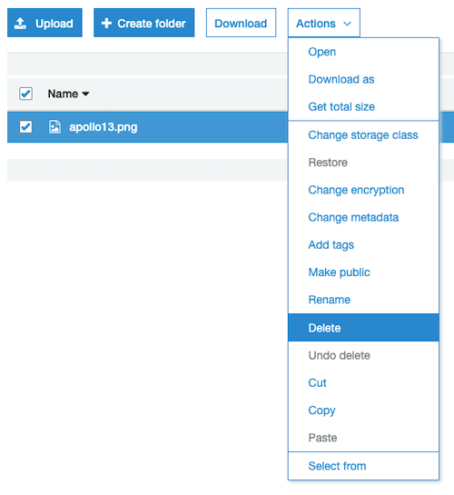
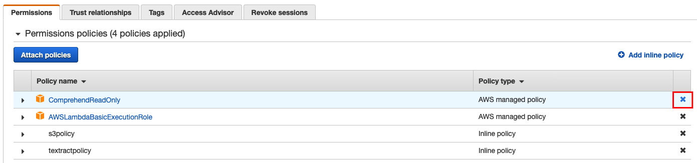

# Index your pile of papers with Amazon Textract, Amazon Comprehend and Amazon Elasticsearch Service

## Overview
### Background
You probably have piles of printed documents in your company, carefully stored in cabinets waiting for an audit, destruction or just to be used at some point. What if it was actually a gold mine, containing precious information on the history of the company you could use to predict and optimize your future? Or simply archive them securely on the cloud for compliance.

Or maybe you receive thousands of documents from you customers each day and want to digitize them and automate their processing.

Whatever the use case, the pipeline is almost always the same:

1. Scan the documents.
2. Digitize them, with an OCR (Optical Character Recognition) tool.
3. Process the document, enrich it, combine with other data, etc.
4. Index it, for further search.

To achieve this process today, many companies extract data from documents manually, which is quite slow and error-prone. Or by using OCR softwares that requires manual customization or hard-coded configuration to match their specific format.

Amazon Textract overcomes these challenges by using machine learning, providing the ability to "read" virtually any type of document to extract text and data without the need of custom code. Once the information is captured, you can use other services like Amazon Comprehend to get insight on it (key phrases, people, dates, ...), Amazon Translate to translate it, Elasticsearch to index it for later search.

### Objective of the workshop

The workshop will demonstrate the usage of the following AWS services to achieve the process mentioned above:

- [Amazon Textract](https://aws.amazon.com/textract/) to extract text and data from scanned documents.
- [Amazon Comprehend](https://aws.amazon.com/comprehend/) to extract the essence of documents, entities.
- [Amazon Elasticsearch Service](https://aws.amazon.com/elasticsearch-service/) to index documents for further search.

The following services will also be used:

- [AWS Lambda](https://aws.amazon.com/lambda/) will trigger and coordinate the full pipeline.
- [Amazon S3](https://aws.amazon.com/s3/) will store the scanned documents.
- [Amazon Cognito](https://aws.amazon.com/cognito/) will be used to secure the access to Kibana (provided with Elasticsearch service to visualize data)

**Note**: We'll use the Python programming language. If you are not familiar with this language, don't worry, the workshop will be guided and code will be provided. Just be aware that [indentation](https://docs.python.org/2.0/ref/indentation.html) is important to determine the structure of the code and statements. If you meet the following error, please review spaces and tabs in your code:
``“unindent does not match any outer indentation level”``

### Business case 
In this workshop, we'll analyze documents from the **Apollo Program**, more precisely flight journals from Apollo 11 and Apollo 13, the two well-known travels to the Moon. If you are interested in the space history, you can find those documents [here](https://history.nasa.gov/afj/). For the workshop, you can find a subset in [documents](./documents/). 

*Image Credit: NASA, [source](https://www.nasa.gov/mission_pages/apollo/40th/images/apollo_image_12.html)*

## LAB 0 - Setup the environment

To start the workshop, we need to setup an environment with Cloudformation. 

Proceed to [Lab 0 - Setup the environment](./Lab0/README.md) to complete setup.

## LAB 1 - Extract text from documents with Amazon Textract
The first step will consist in using AWS Lambda to manipulate Amazon Textract API to extract text from documents.

[Lab 1a - Synchronous](./synchronous/Lab1/README.md) | [Lab 1b - Asynchronous](./asynchronous/Lab1/README.md)

## LAB 2 - Extract entities with Amazon Comprehend
In this step, we'll use Amazon Comprehend to extract entities from the text.

[Lab 2a - Synchronous](./synchronous/Lab2/README.md) | [Lab 2b - Asynchronous](./asynchronous/Lab2/README.md)

## LAB 3 - Index content in Amazon Elasticsearch Service
In this third step, we will store the content of the document, plus the detected entities in Amazon Elasticsearch Service, so that we can search after.

[Lab 3a - Synchronous](./synchronous/Lab3/README.md) | [Lab 3b - Asynchronous](./asynchronous/Lab3/README.md)

## Cleanup
- The first thing to do is to empty the S3 bucket created in lab 0. Go to S3 in your *workshop-textract-xyz* bucket, and delete all files:

- In the role where you manually added ComprehendReadOnly policy, you need to remove it manually (same thing for TranslateReadOnly or TextractFullAccess in the asynchronous version):

- If you used the CloudFormation templates during the labs, got to [CloudFormation stacks](https://console.aws.amazon.com/cloudformation/home?region=us-east-1#/stacks) console and delete the different stacks you created.

- For all manual creations, you will need to do it manually:

   - remove the SNS Topic
   - remove the second Lambda function (documentAnalysis)