[Workshop](../../README.md) | [Lab 0](../../Lab0/README.md) 

# LAB 1 - Asynchronous - Extract text from documents with Textract

[Amazon Textract](https://docs.aws.amazon.com/textract/latest/dg/what-is.html) is a service that automatically extract text and data from scanned documents. With Textract, you can quickly automate document workflows and process millions of document pages in hours.

<a name="archi_async"></a>

## Architecture
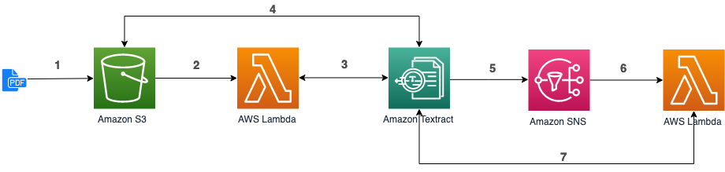

1. Upload a document in S3.
2. S3 triggers the execution of a Lambda function (already done in [Lab 0](../Lab0/README.md)).
3. The function use the asynchronous Textract API (``StartDocumentTextDetection``). Textract returns a JobId to the Lambda function .
4. Textract reads the document in S3 and performs the text extraction.
5. Textract publishes the result of the extraction in a SNS Topic.
6. Another Lambda function, registered to the topic, is triggered.
7. The second Lambda function call the Textract API (``GetDocumentTextDetection``) with the JobId provided in the SNS message, to get the result of the extraction.
  
## Lambda (step 3-4)
In [Lambda console](https://console.aws.amazon.com/lambda/home#/functions), click on your *documentTextract-xyz* function, scroll down to edit code inside the browser. Replace the code with the following one and click **Save**:

```python
import urllib
import boto3
import os

textract = boto3.client('textract')

sns_topic_arn = os.environ["SNS_TOPIC_ARN"]
sns_role_arn = os.environ["SNS_ROLE_ARN"]


def handler(event, context):
	source_bucket = event['Records'][0]['s3']['bucket']['name']
	object_key = urllib.parse.unquote_plus(
					event['Records'][0]['s3']['object']['key'])

	textract_result = textract.start_document_text_detection(
		DocumentLocation={
			"S3Object": {
				"Bucket": source_bucket,
				"Name": object_key
			}
		},
		NotificationChannel={
			"SNSTopicArn": sns_topic_arn,
			"RoleArn": sns_role_arn
		}
	)
	print(textract_result)

```

We use the [``StartDocumentTextDetection``](https://docs.aws.amazon.com/textract/latest/dg/API_StartDocumentTextDetection.html) API to start asynchronous detection of text in a document (JPG, PNG, PDF). When the text detection is finished, Textract publishes a completion status to the SNS topic specified in ``NotificationChannel``. As you notice, we need to provide the ARN of the SNS Topic and the ARN of a role. This role will be assumed by Textract and will allow Textract to publish in SNS. Let's setup this...
  
## Setup SNS (step 5)

### Create the SNS Topic
In Amazon [SNS console](https://console.aws.amazon.com/sns/v3/home#/topics) (Simple Notification Service), click **Create Topic**.

Choose a name for your topic and leave the details as is, then click **Create topic** at the bottom of the page:

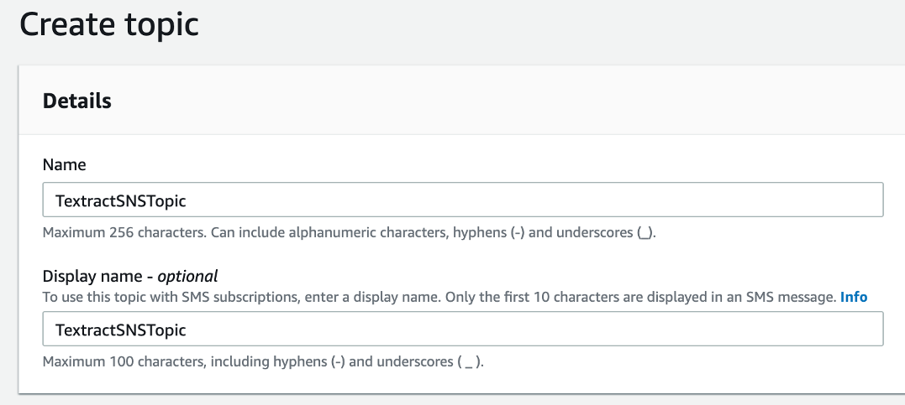

[More details on the creation of an Amazon SNS Topic](https://docs.aws.amazon.com/sns/latest/dg/sns-tutorial-create-topic.html).

Copy the Topic ARN in a text document for later use.

### Give Textract access to the SNS Topic
In order for Textract to publish messages in the topic, we need to give him the permissions to do so.

In [IAM console](https://console.aws.amazon.com/iam/home), choose Roles on the naviagtion page and create a new Role. 

In the role creation process (step 1), select **AWS service** as type of trusted entity and **EC2** as the service that will use this role (we'll change that in a minute). Then click **Next: Permissions**:

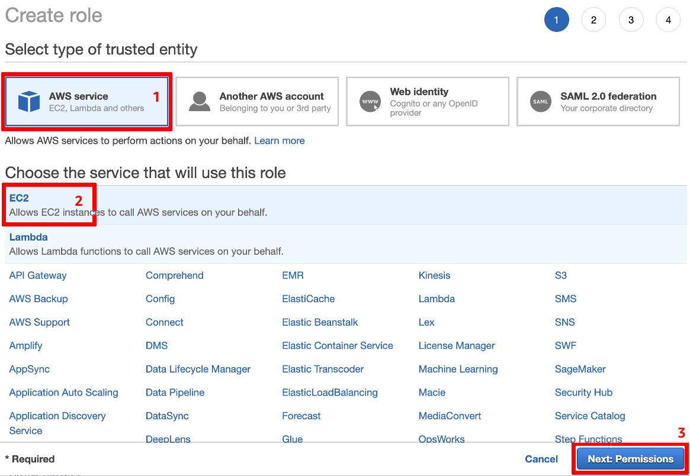

In step 2, choose **Create Policy**. In the newly opened window, select the JSON tab and past the following policy, replace the ARN with the Topic ARN previously copied. This policy will allow to publish some messages on the Topic previously created:

```json
{
    "Version": "2012-10-17",
    "Statement": [
        {
            "Effect": "Allow",
            "Action": [
                "sns:Publish"
            ],
            "Resource": "arn:aws:sns:REGION:ACCOUNTID:TOPIC_NAME>"
        }
    ]
}
```
Click **Review Policy**. In the "Review Policy" screen, add a name and a description and click **Create Policy**:


Back to the role creation screen, hit the refresh button () and type the beginning of the policy name in the filter, select the policy and click **Next: Tags**:

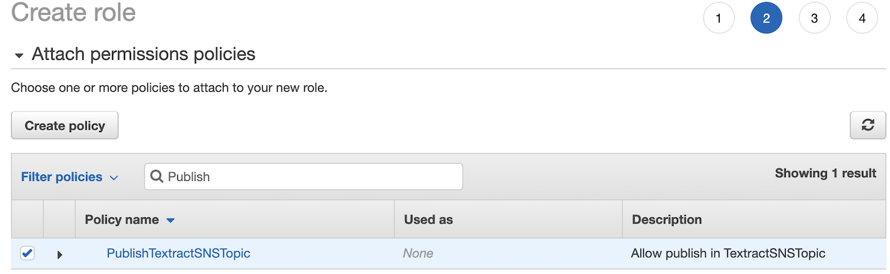

You don't need to add tags, go to Step 4 (click **Next: Review**), add a name and a description for the role and click **Create Role**:

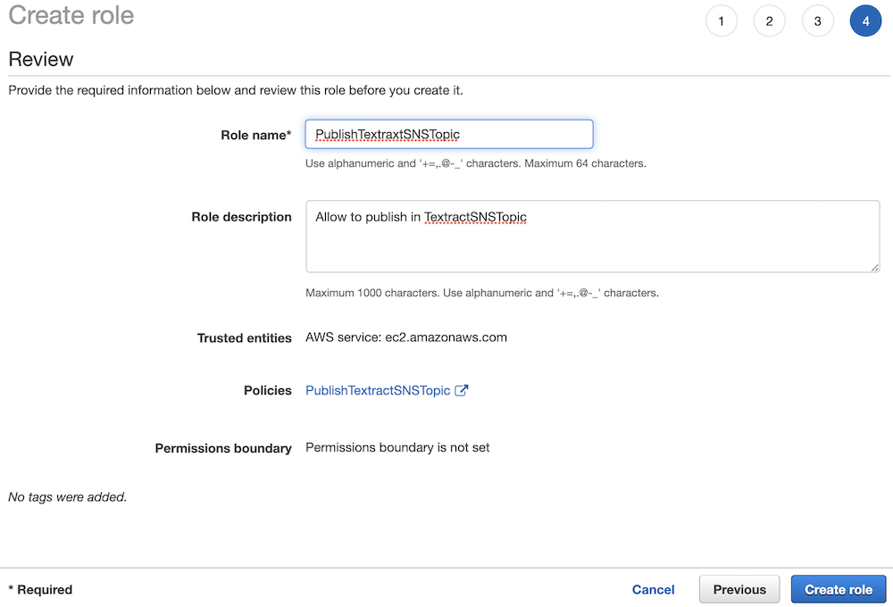

This role can be assumed by an EC2 instance, not yet by Textract. To change this, we need to update the trust relationship. Select your role to get the details and select the **Trust relationships** tab, then click on **Edit trust relationship**:

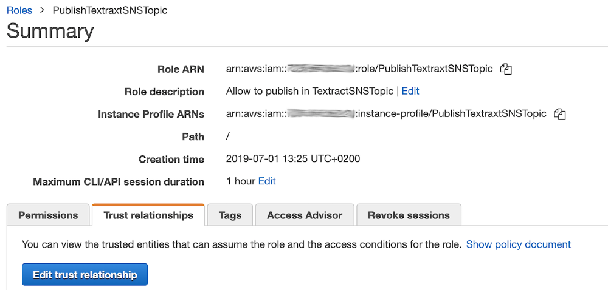

In the trust relationship screen, replace **ec2** with **textract**. You should get the following policy:

<pre>
{
  "Version": "2012-10-17",
  "Statement": [
    {
      "Effect": "Allow",
      "Principal": {
        "Service": "<b>textract.amazonaws.com</b>"
      },
      "Action": "sts:AssumeRole"
    }
  ]
}
</pre>

Once it is done, click **Update trust policy** button. With this policy, Textract is now able to assume the role. Copy the role ARN for later use.

### Update the lambda function 
In [Lambda](https://console.aws.amazon.com/lambda/home#/functions), click on your *documentTextract-xyz* function, scroll down to **Environment variables** and add the following variables (retrieve the SNS topic ARN and Role ARN previously created) and click **Save**:

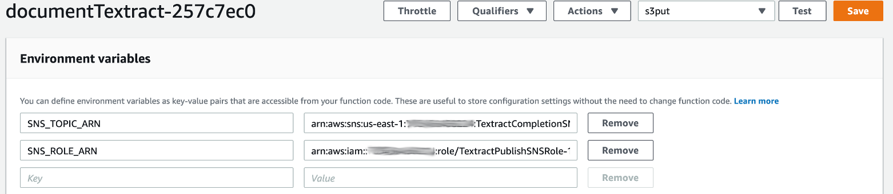

### Test
In order to test the process, you need to upload an document in the *workshop-textract-xyz* S3 bucket. You can take any PDF from this [folder](../documents) and upload it to the bucket. In [S3 console](https://s3.console.aws.amazon.com/s3/buckets/), click on your *workshop-textract-xyz* bucket, and click on **Upload**.

If you go to [CloudWatch logs](https://console.aws.amazon.com/cloudwatch/home#logs:prefix=/aws/lambda/documentTextract), you will be able to display the output of your lambda execution. You should get a json containing a ``JobId`` (see [documentation](https://docs.aws.amazon.com/textract/latest/dg/async-notification-payload.html) for details on the result). Copy that JobId, we will use it later for another test.

As for now, we don't have any subscription to the SNS Topic. Let's arrange that...

## Setup the 2nd Lambda function (step 6-7)
  
### Create the function that will process the result of Textract
In [Lambda](https://console.aws.amazon.com/lambda/home#/functions), click on **Create function**, select **Author from scratch** and fill the basic information as follow, leave the permissions as is and click on **Create function** when it's done:

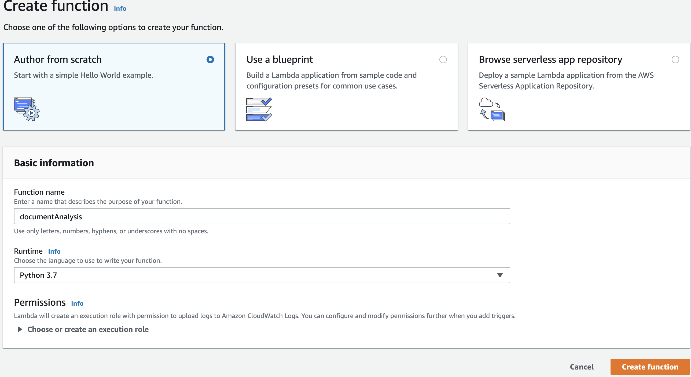

#### Configure the timeout and memory
Within the Lambda function screen, if you scroll down, you should be able to see the **Basic Settings** of the function. Adjust the memory slider to 256 MB and Timeout to 5 minutes. Don't forget to hit **Save**:

 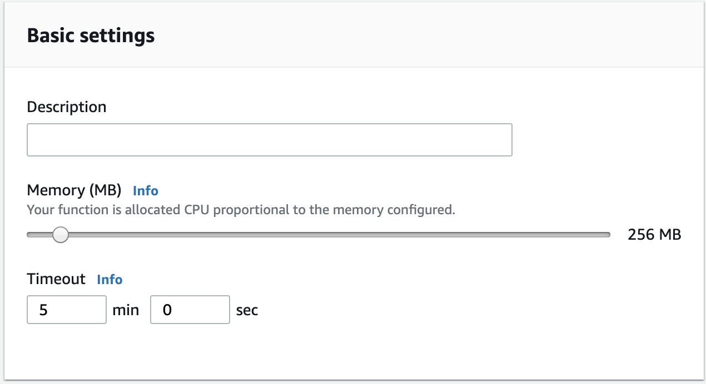

<a name="permissions_textract"></a>
#### Add permissions to the function
The function needs persmissions to invoke Textract. Let's update the role automatically created during the function creation. Click on the *documentAnalysis* function:

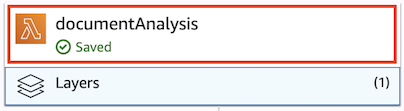

Then scroll down to the **Execution Role** and click **View the documentAnalysis-role-xyz**:


In the new window, click on **Attach policies**, search for "Textract". You should have the following screen. Select the ``AmazonTextractFullAccess`` policy and click **Attach policy**:

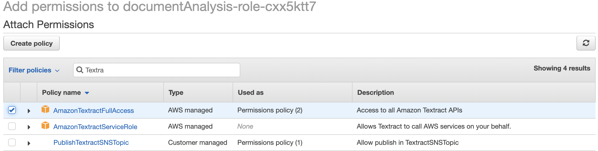

Back to the lambda function screen, refresh the page, you should now see Amazon Textract in the *Permissions* tab. Our lambda function is able to call Textract APIs:

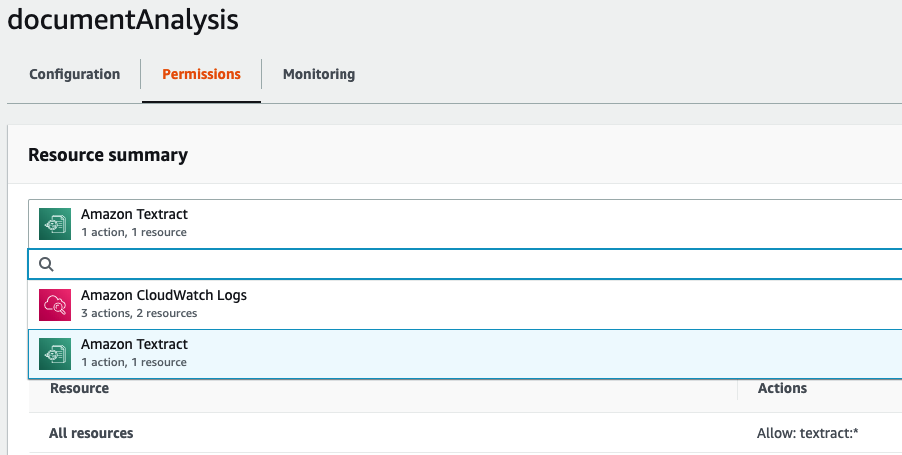

### Subscribe the Lambda function to the SNS Topic

Now we need to trigger the function when a message is published in the SNS topic previously created. To do that, click **Add a trigger**:

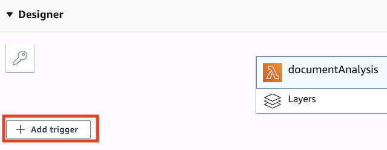

Choose **SNS** and select the SNS topic to subscribe to, then click **Add**:

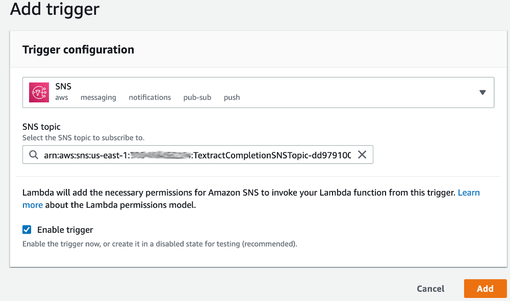

The lambda function is now ready to receive the notification events from SNS.

### Update the lambda code to get Textract result

We will now edit the lambda code to call Textract and retrieve the content of the document. In Lambda, click on your documentAnalysis-xyz function, scroll down to edit code and replace the code with the following one:

```python
import json
import boto3

textract = boto3.client('textract')


def lambda_handler(event, context):
    message = json.loads(event['Records'][0]['Sns']['Message'])

    jobId = message['JobId']
    print("JobId="+jobId)

    status = message['Status']
    print("Status="+status)

    if status != "SUCCEEDED":
        return {
            # TODO (not in this workshop): handle error with Dead letter queue
            # https://docs.aws.amazon.com/lambda/latest/dg/dlq.html
            "status": status
        }

    result = textract.get_document_text_detection(
        JobId=jobId
    )

    print(result)

```
We retrieve the SNS message from the lambda event and then use the [``GetDocumentTextDetection``](https://docs.aws.amazon.com/textract/latest/dg/API_GetDocumentTextDetection.html) API (``get_document_text_detection``in python), passing the ``JobId`` as parameter, to get Textract result.


### Test
In order to test the process, we will create a Test Event and simulate a SNS notification. On the top right of the screen, click **Configure test events**:

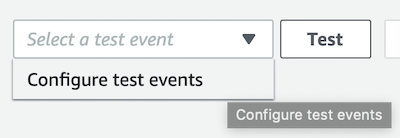

Give a name and paste the following json, replace the JobId placeholder with the one you copied before and hit **Create** when it's done:

```json
{
  "Records": [
    {
      "EventSource": "aws:sns",
      "EventVersion": "1.0",
      "Sns": {
        "Type": "Notification",
        "MessageId": "b4755b6e-f9df-53c5-8b16-0e57fe4af33a",
        "Subject": "",
        "Message": "{\"JobId\":\"<PLACE YOUR JOBID HERE>\",\"Status\":\"SUCCEEDED\",\"API\":\"StartDocumentTextDetection\",\"JobTag\":\"\",\"Timestamp\":1556022612893,\"DocumentLocation\":{\"S3ObjectName\":\"document.pdf\",\"S3Bucket\":\"workshop-textract-xyz\"}}",
        "Timestamp": "2019-04-23T12:30:13.249Z"
      }
    }
  ]
}
```
Click on **Test** button, you should get a green panel with a success result.

If you go to [CloudWatch logs](https://console.aws.amazon.com/cloudwatch/home#logs:prefix=/aws/lambda/documentAnalysis), you will be able to display the output of your lambda execution. You should get a json in the following form ([details here](https://docs.aws.amazon.com/textract/latest/dg/API_DetectDocumentText.html#API_DetectDocumentText_ResponseSyntax)):

```json
{
   "Blocks": [ 
      { 
         "BlockType": "PAGE | LINE | WORD",
         "Confidence": 99.9523696899414,
         "Geometry": { 
            "BoundingBox": { 
               "Height": 0.02243288792669773,
               "Left": 0.42624378204345703,
               "Top": 0.04024827480316162,
               "Width": 0.41624754667282104
            }, ...
         },
         "Id": "a0730187-e3e5-46c5-973a-fb0c09c6ba00",
         "Page": 1,
         "Text": "part of the text detected",
         ...
      }, ...
   ],
   "DocumentMetadata": { 
      "Pages": 1
   }
}
```

It contains a list of Blocks, each Block representing an item recognized in the document (can either be a page, a line or a simple word). For each block you will retrieve its hierarchy in the document, its geometry (position and size), ... and obviously a text and the confidence score that Textract has in the accuracy of the recognized text.

Once we have the full details, we need to parse the result to extract the important data.

### Update the lambda code to extract content

In the inline code editor, click **File**, **New file** and paste the following code:

```python
import time
import boto3

textract = boto3.client('textract')


class TextExtractor():
    def extract_text(self, jobId):
        """ Extract text from document corresponding to jobId and
        generate a list of pages containing the text
        """

        textract_result = self.__get_textract_result(jobId)
        pages = {}
        self.__extract_all_pages(jobId, textract_result, pages, [])
        return pages

    def __get_textract_result(self, jobId):
        """ retrieve textract result with job Id """

        result = textract.get_document_text_detection(
            JobId=jobId
        )
        return result

    def __extract_all_pages(self, jobId, textract_result, pages, page_numbers):
        """ extract page content: build the pages array,
        recurse if response is too big (when NextToken is provided by textract)
        """

        blocks = [x for x in textract_result['Blocks']
                  if x['BlockType'] == "LINE"]
        for block in blocks:
            if block['Page'] not in page_numbers:
                page_numbers.append(block['Page'])
                pages[block['Page']] = {
                    "Number": block['Page'],
                    "Content": block['Text']
                }
            else:
                pages[block['Page']]['Content'] += " " + block['Text']

        nextToken = textract_result.get("NextToken", "")
        if nextToken != '':
            textract_result = textract.get_document_text_detection(
                JobId=jobId,
                NextToken=nextToken
            )
            self.__extract_all_pages(jobId,
                                     textract_result,
                                     pages,
                                     page_numbers)

```

Take a moment to analyse the code:

 - This is a class, dedicated to the extraction of the text. We will use it in a moment in the handler of the function.
 - Same as before, we use the [``GetDocumentTextDetection``](https://docs.aws.amazon.com/textract/latest/dg/API_GetDocumentTextDetection.html) API (``get_document_text_detection``in python), passing the ``JobId`` as parameter, to get Textract result.
 - Then we use a recursive function to extract all pages from the document. Indeed, the ``GetDocumentTextDetection`` API returns a maximum of 1000 Blocks, and provide a ``NextToken`` if there are more to retrieve. With this pagination mechanism, you can call the method again, passing the ``JobId`` and the ``NextToken`` from the previous call, until there is no more ``NextToken`` in the result.

Once you're comfortable with the code, click **File**, **Save** (*text_extractor.py*):

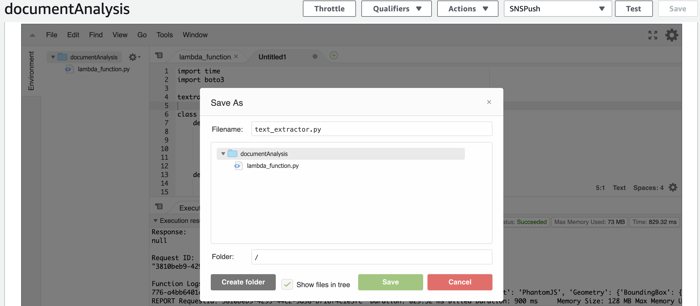

In the *lambda_function.py* file, replace the code with the following in order to use the class we've just created:

```python
import json
from text_extractor import TextExtractor

text_extractor = TextExtractor()


def lambda_handler(event, context):
    message = json.loads(event['Records'][0]['Sns']['Message'])

    jobId = message['JobId']
    print("JobId="+jobId)

    status = message['Status']
    print("Status="+status)

    if status != "SUCCEEDED":
        return {
            # TODO : handle error with Dead letter queue (not in this workshop)
            # https://docs.aws.amazon.com/lambda/latest/dg/dlq.html
            "status": status
        }

    pages = text_extractor.extract_text(jobId)
    print(list(pages.values()))

```

Hit **Save** in the top right corner of the screen and then click **Test**. Observe the result in [CloudWatch logs](https://console.aws.amazon.com/cloudwatch/home#logs:prefix=/aws/lambda/documentAnalysis).

In this asynchronous version, we could have used Amazon SQS (Queue) to poll the SNS Topic to deal with the load when you need to scale up agressively (thousands of documents uploaded on S3 within seconds). 
Indeed, when dealing with such a quantity of documents, Lambda will start many Textract jobs concurrently and that could result in errors (``LimitExceededException``) and untreated documents. To avoid this, using SQS will decouple the SNS Topic from the Lambda and provide a buffer. Thus, if a document cannot be treated immediatly, it remain in the queue until the number of concurrent Textract jobs is below the service limit.
See [documentation](https://docs.aws.amazon.com/textract/latest/dg/api-async.html) for more details.

**! TIPS !** Instead of parsing the result of textract on your own, you can use [textract-extractor](https://github.com/aws-samples/amazon-textract-textractor) or [textract-response-parser](https://github.com/aws-samples/amazon-textract-response-parser).

**! Note !** In this workshop, we only extracted plain text from the documents, but Amazon Textract is able to do more: You can extract key-value pairs from forms (such as regristration forms). Textract also detects and extract structured data, for example in tables, and keep this tabular format so that you can store it directly in a database. See [https://aws.amazon.com/textract/features/](https://aws.amazon.com/textract/features/) for details.

# LAB 2
In this lab, we used Amazon Textract to extract text from a scanned document. 
In Lab 2, we will use Amazon Comprehend to extract information from the extracted text.

[Goto to Lab 2 >>>](../Lab2/README.md)