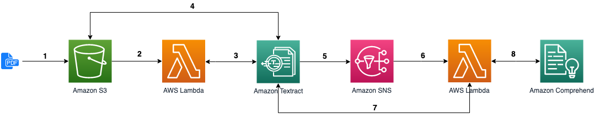
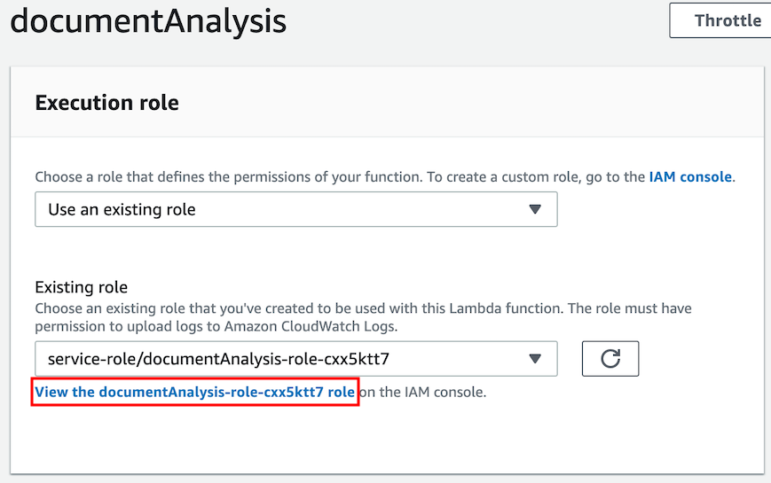
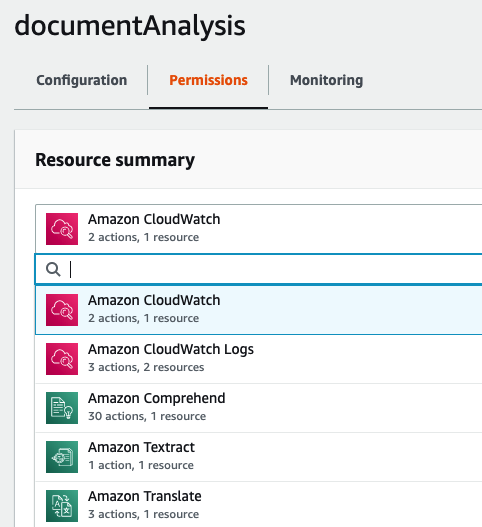

[Workshop](../../README.md) | [Lab 0](../../Lab0/README.md) | [Lab 1](../../Lab1/README.md)

# LAB 2 - Asynchronous - Extract entities with Comprehend

[Amazon Comprehend](https://docs.aws.amazon.com/comprehend/latest/dg/what-is.html) is a service that uses natural language processing (NLP) to extract insights about the content of documents. Comprehend takes text (UTF-8) as input and recognize entities, key phrases, language and sentiments.

In this lab, we will use the text previously extracted with Textract and apply Comprehend on it, in order to retrieve entities.

Either you chose the synchronous path or the asynchronous one, the job will be done in one or the other Lambda function.

<a name="archi_async"></a> 

## Architecture


[See steps 1-7 from Lab 1](../Lab1/README.md#archi_async)

In step 8, we call the ``DetectEntities`` API from Comprehend in the second Lambda function we created, the one that deals with the result of Textract (*documentAnalysis*).

### Add permissions to the function
The function needs persmissions to invoke Comprehend. Let's update the role automatically created during the function creation. Click on the *documentAnalysis* function, then scroll down to the **Execution Role** and click **View the documentAnalysis-role-xyz**:



In the new window, click on **Attach policies**, search for *ComprehendReadOnly*, check it. Then search for *TranslateReadOnly*, check it and click **Attach policy**:


Back to the lambda function screen, refresh the page, you should now see Amazon Comprehend and Amazon Translate in the *Permissions* tab. Our lambda function is now able to call both Comprehend and Translate APIs:



### Update the lambda code to call Comprehend

In the inline code editor, click **File**, **New file** and paste the following code:

```python
import boto3

comprehend = boto3.client('comprehend')
translate = boto3.client('translate')


class DocumentAnalyzer():
    def extract_entities(self, pages):
        """ extract entities from pages with Comprehend """

        selected_entity_types = ["ORGANIZATION", "PERSON", "LOCATION", "DATE"]

        final_entities = []
        for page in pages:
            text = self.__get_clean_text_in_supported_language(page['Content'])

            detected_entities = comprehend.detect_entities(
                Text=text,
                LanguageCode="en"
            )

            # uncomment to see output of comprehend
            # print(detected_entities)

            selected_entities = [x for x in detected_entities['Entities']
                                 if x['Score'] > 0.9 and
                                 x['Type'] in selected_entity_types]

            for selected_entity in selected_entities:
                clean_entity = {key: selected_entity[key]
                                for key in ["Text", "Type"]}
                if clean_entity not in final_entities:
                    final_entities.append(clean_entity)

        return final_entities

    def __get_clean_text_in_supported_language(self, inputText):
        """ Prepare text for Comprehend:
        reduce the size of the text to 5000 bytes
        and translate it in english if not in supported language """

        # max size for Comprehend: 5000 bytes
        text = inputText[:5000]

        languages = comprehend.detect_dominant_language(
            Text=text
        )
        dominant_languages = sorted(languages['Languages'],
                                    key=lambda k: k['LanguageCode'])
        dominant_language = dominant_languages[0]['LanguageCode']

        if dominant_language not in ['en', 'es', 'fr', 'de', 'it', 'pt']:
            translation = translate.translate_text(
                Text=text,
                SourceLanguageCode=dominant_language,
                TargetLanguageCode="en"
            )
            text = translation['TranslatedText']

        return text[:5000]

```

Take a moment to analyse the code:

 - This is a class, dedicated to the document analysis with Comprehend. We will use it in a moment in the handler of the function.

 - Before calling the ``DetectEntities`` API, we need to be aware of few [limits](https://docs.aws.amazon.com/comprehend/latest/dg/API_DetectEntities.html#API_DetectEntities_RequestParameters) of the service: 

   - First, the text must contain less that 5000 bytes (UTF-8 encoded characters). That's why we cut the text to 5000 on the first line.
  
   - Second, the text must be in a supported language: German ("de"), English ("en"), Spanish ("es"), French ("fr"), Italian ("it"), or Portuguese ("pt"). Comprehend provides [an API to detect the language of a document](https://docs.aws.amazon.com/comprehend/latest/dg/API_DetectDominantLanguage.html). We associate this with another service, Amazon Translate, to get the translation of the text in the desired language, if not already.

- We then call the [``DetectEntities``](https://docs.aws.amazon.com/comprehend/latest/dg/API_DetectEntities.html) API to retrieve entities in the document. The API will return a list of [Entity](https://docs.aws.amazon.com/comprehend/latest/dg/API_Entity.html): the text, their position (offsets), a score for the level of confidence, and a type (PERSON, LOCATION, ORGANIZATION, DATE, ...). In our code, we select only a subset of all types and only the entities with a score higher than 0.9 over 1. You can test without that filter if you want to see everything that is returned by Comprehend.

Once you're comfortable with the code, click **File**, **Save**, and use *document_analyzer.py* as filename.

In the *lambda_function.py* file, add the following code at the top:

```python
from document_analyzer import DocumentAnalyzer
document_analyzer = DocumentAnalyzer()
```

And the following one at the end of the lambda_handler function:

```python
    entities = document_analyzer.extract_entities(list(pages.values()))
    print(entities)
```
Hit **Save** in the top right corner of the screen and then click **Test**. Observe the result in [CloudWatch logs](https://console.aws.amazon.com/cloudwatch/home#logs:prefix=/aws/lambda/documentAnalysis): 

```
[{'Text': 'SUNDAY July 6, 1969', 'Type': 'DATE'}, {'Text': 'NASA', 'Type': 'ORGANIZATION'}, {'Text': 'Neil A. Armstrong', 'Type': 'PERSON'}, ...]
```

# LAB 3
In Lab 3, we will index both the content text and the entities in Elasticsearch.

[Goto to Lab 3 >>>](../Lab3/README.md)