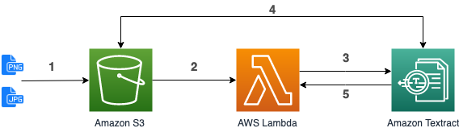

[Workshop](../../README.md) | [Lab 0](../../Lab0/README.md)

# LAB 1 - Synchronous - Extract text from documents with Textract

[Amazon Textract](https://docs.aws.amazon.com/textract/latest/dg/what-is.html) is a service that automatically extract text and data from scanned documents. With Textract, you can quickly automate document workflows and process millions of document pages in hours.

<a name="archi_sync"></a>
### Architecture


1. Upload a document in S3. 
2. S3 triggers the execution of a Lambda function (already done in [Lab 0](../../Lab0/README.md)).
3. The function use the synchronous Textract API (``DetectDocumentText``).
4. Textract reads the document in S3 and extract the text from it.
5. Textract return the extracted text to the Lambda function.
  

## Lambda (step 3)
In [Lambda console](https://console.aws.amazon.com/lambda/home#/functions), click on your *documentTextract-xyz* function, scroll down to edit code inside the browser. Replace the code with the following one and click **Save**:

```python
import urllib
import boto3

textract = boto3.client('textract')

def handler(event, context):
	source_bucket = event['Records'][0]['s3']['bucket']['name']
	object_key = urllib.parse.unquote_plus(event['Records'][0]['s3']['object']['key'])
	
	textract_result = textract.detect_document_text(
		Document={
			'S3Object': {
				'Bucket': source_bucket,
				'Name': object_key
			}
		}
	)
	print(textract_result)

```
We use the [``DetectDocumentText``](https://docs.aws.amazon.com/textract/latest/dg/API_DetectDocumentText.html) API to extract the text from an image (JPEG or PNG) retrieved in S3.

<a name="test"></a>
### Test
In order to test the process, you need to upload an image in the *workshop-textract-xyz* S3 bucket. In [S3 console](https://s3.console.aws.amazon.com/s3/buckets/), click on your *workshop-textract-xyz* bucket, and click on **Upload**.

You can use one of those pictures:

 - [apollo11-summary.png](../../documents/apollo11-summary.png) 
 - [apollo11.png](../../documents/apollo11.png) which is slightly rotated
 - [apollo13.png](../../documents/apollo13.png) with a 90 degree rotation
 - [apollo13-summary.png](../../documents/apollo13-summary.png) which contains underlining and overlining of some text.

If you go to [CloudWatch logs](https://console.aws.amazon.com/cloudwatch/home#logs:prefix=/aws/lambda/documentTextract), you will be able to display the output of your lambda execution. You should get a json in the following form ([details here](https://docs.aws.amazon.com/textract/latest/dg/API_DetectDocumentText.html#API_DetectDocumentText_ResponseSyntax)):

```json
{
   "Blocks": [ 
      { 
         "BlockType": "PAGE | LINE | WORD",
         "Confidence": 99.9523696899414,
         "Geometry": { 
            "BoundingBox": { 
               "Height": 0.02243288792669773,
               "Left": 0.42624378204345703,
               "Top": 0.04024827480316162,
               "Width": 0.41624754667282104
            }, ...
         },
         "Id": "a0730187-e3e5-46c5-973a-fb0c09c6ba00",
         "Page": 1,
         "Text": "part of the text detected",
         ...
      }, ...
   ],
   "DocumentMetadata": { 
      "Pages": 1
   }
}
```

It contains a list of Blocks, each Block representing an item recognized in the document (can either be a page, a line or a simple word). For each block you will retrieve its hierarchy in the document, its geometry (position and size), ... and obviously a text and the confidence score that Textract has in the accuracy of the recognized text.

Once we have the full details, we need to parse the result to extract the important data. In this case, we simply want the full text. In the *documentTextract-xyz* Lambda function, replace ``print(textract_result)`` with: 

```python
	page=""
	blocks = [x for x in textract_result['Blocks'] if x['BlockType'] == "LINE"]
	for block in blocks:
		page += " " + block['Text']
        	
	print(page)
```
It's a simple way to retrieve all lines (BlockType = LINE) and to concatenate them. You can now [test](#test) your function again to see the content of your document, loading a new test image or re-uploading the same as before. In [CloudWatch logs](https://console.aws.amazon.com/cloudwatch/home#logs:prefix=/aws/lambda/documentTextract), you will see the plain text, extracted from the picture you've just uploaded.

**! TIPS !** Instead of parsing the result of textract on your own, you can use [textract-extractor](https://github.com/aws-samples/amazon-textract-textractor) or [textract-response-parser](https://github.com/aws-samples/amazon-textract-response-parser)

**! Note !** In this workshop, we only extracted plain text from the documents, but Amazon Textract is able to do more: You can extract key-value pairs from forms (such as regristration forms). Textract also detects and extract structured data, for example in tables, and keep this tabular format so that you can store it directly in a database. See [https://aws.amazon.com/textract/features/](https://aws.amazon.com/textract/features/) for details.

# LAB 2
In this lab, we used Amazon Textract to extract text from a scanned document. 
In Lab 2, we will use Amazon Comprehend to extract information from the extracted text.

[Goto to Lab 2 >>>](../Lab2/README.md)