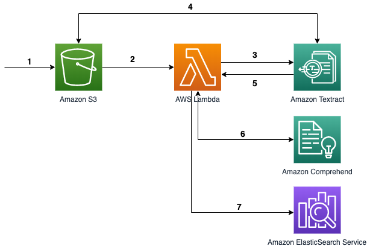
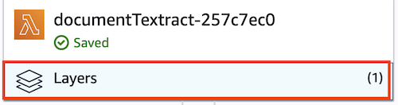
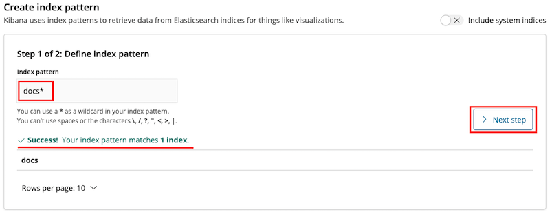
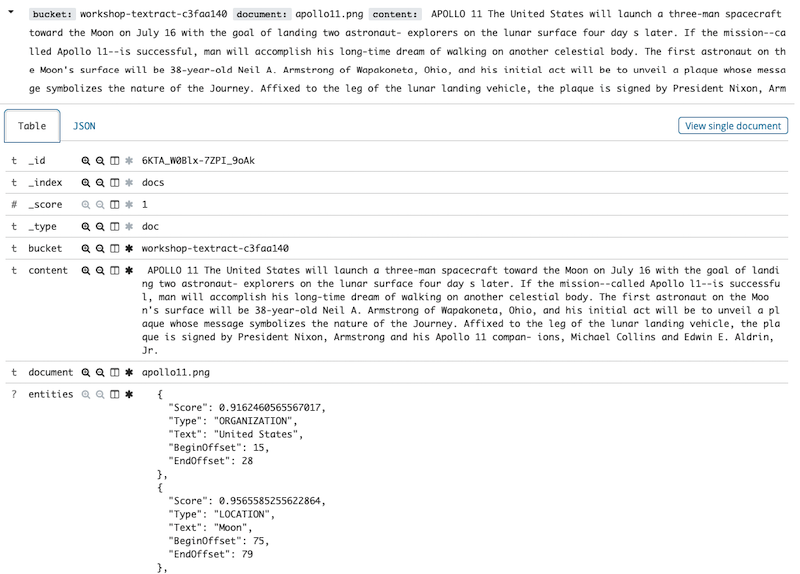

[Workshop](../../README.md) | [Lab 0](../../Lab0/README.md) | [Lab 1](../../Lab1/README.md) | [Lab 2](../../Lab2/README.md)

# LAB 3 - Synchronous - Index documents and entities in Elasticsearch

[Amazon Elasticsearch Service](https://aws.amazon.com/elasticsearch-service) is a managed Elasticsearch, the famous search engine based on Lucene library. It enables the indexing of billions of documents and offers near real-time search from those documents. In this lab, we will use it to store the content of our scanned documents and associated entities.

## Elasticsearch & Kibana
We first need to setup an Elasticsearch *domain* (a cluster) and secure the Kibana console with Cognito. The following Cloudformation template will setup everything for you. Just type your email address (use a valid address you can access) and a name for the domain when prompted (step 2). 

Region | Button
------------ | -------------
us-east-1 | [](https://console.aws.amazon.com/cloudformation/home?region=us-east-1#/stacks/new?stackName=DocumentIndexingStack&templateURL=https://s3.amazonaws.com/aws-textract-workshop-us-east-1/bootstrap/es-template.yaml)
eu-west-1 | [](https://console.aws.amazon.com/cloudformation/home?region=eu-west-1#/stacks/new?stackName=DocumentIndexingStack&templateURL=https://s3.amazonaws.com/aws-textract-workshop-eu-west-1/bootstrap/es-template.yaml)
ap-southeast-1 | [](https://console.aws.amazon.com/cloudformation/home?region=ap-southeast-1#/stacks/new?stackName=DocumentIndexingStack&templateURL=https://s3.amazonaws.com/aws-textract-workshop-ap-southeast-1/bootstrap/es-template.yaml)

In the last step, you will need to check several checkboxes to allow the creation of IAM resources:


It may take few minutes to deploy everything (you can have a look at the rest of the lab but you will need resources to be ready to complete it). In the [CloudFormation Console](https://console.aws.amazon.com/cloudformation/home), in Outputs tab, you should have the following. Keep these information in safe place for later use (copy past in text document or keep browser tab opened). You should also receive an email with a password to access the Kibana interface.


More details on Cognito authentication for Kibana [here](https://docs.aws.amazon.com/elasticsearch-service/latest/developerguide/es-cognito-auth.html).

## Architecture


In this lab, we will focus on step 7, in which we will index the data in ElasticSearch. See labs [1](../Lab1/README.md#archi_sync) and [2](../Lab2/README.md#archi_sync) for the previous steps.

## Dependencies for the lambda function
As the function will interact with ElasticSearch, we need to provide some libraries. We'll do that using a [Lambda Layer](https://docs.aws.amazon.com/lambda/latest/dg/configuration-layers.html). A layer is zip archive that contains libraries or dependencies you can use in a Lambda function without needing to include it in the Lambda package itself. In [Lambda](https://console.aws.amazon.com/lambda/home), click on your *documentTextract-xyz* function then click on **Layers**:



Scroll down and click **Add a layer**. In the newly opened window, select **"ElasticLibs"** in the dropdown under Name and the latest version under Version, click **Add** when it's done. In the function screen, click **Save** at the top.

We'll also need to provide the URL of the ElasticSearch Domain. Scroll down to **Environment variables** and add the following variable (key: ELASTIC_SEARCH_HOST, value: put the *ElasticsearchDomain* URL you got from CloudFormation), and click **Save**:


## Permissions
The function needs permissions to access ElasticSearch. As mentioned above, the domain is currently protected with Cognito. Go to [ElasticSearch service console](https://console.aws.amazon.com/es/home), select your domain, then click on **Modify access policy**


In the policy editor, we will add permissions (`es:ESHttpPost`) for the Lambda execution role. Add the following block of JSON to the existing one (within the *Statement* array):

```json
, 
   {
      "Effect": "Allow",
      "Principal": {
        "AWS": "arn:aws:iam::111111111111:role/textract-index-stack-LambdaExecutionRole-12A34B56D78E"
      },
      "Action": "es:ESHttpPost",
      "Resource": "arn:aws:es:us-east-1:111111111111:domain/apollodocumentsearch/*"
    }
```

a. Replace AWS principal ARN value with the one from your Lambda function. You can find it in your lambda function by clicking the  **View the TextractApolloWorkshopStack-....** link:


b. Change the "111111111" with your account ID (you can see it in the JSON block already available).

c. Replace "documentsearchapp" with the name of your Elasticsearch domain created in the stack (see Cloudformation outputs).

At the end, you should have something like that (with your own values), **do not** copy past this block:

```json
{
  "Version": "2012-10-17",
  "Statement": [
    {
      "Effect": "Allow",
      "Principal": {
        "AWS": "arn:aws:sts::111111111111:assumed-role/es-stack-CognitoAuthorizedRole-1AB2CD3EF4GH/CognitoIdentityCredentials"
      },
      "Action": "es:*",
      "Resource": "arn:aws:es:us-east-1:111111111111:domain/apollodocumentsearch/*"
    },
    {
      "Effect": "Allow",
      "Principal": {
        "AWS": "arn:aws:iam::111111111111:role/textract-index-stack-LambdaExecutionRole-12A34B56D78E"
      },
      "Action": "es:ESHttpPost",
      "Resource": "arn:aws:es:us-east-1:111111111111:domain/apollodocumentsearch/*"
    }
  ]
}
```
Click **Submit** on the bottom right of the page and wait few seconds so it is taken into account (Domain status needs to be active" again).

## Update the code
Back to yout lambda function, below `import boto3`, add the following code:

```python
import os
import requests
from requests_aws4auth import AWS4Auth

region=os.environ['AWS_REGION']
service = 'es'
credentials = boto3.Session().get_credentials()
awsauth = AWS4Auth(credentials.access_key, credentials.secret_key, region, service, session_token=credentials.token)
elastic_search_host = os.environ["ELASTIC_SEARCH_HOST"]
index = "docs"
type = "doc"
headers = { "Content-Type": "application/json" }
elastic_url = elastic_search_host + index + '/' + type
```
Few things to notice:

- We could also use the [Elasticsearch library](https://elasticsearch-py.readthedocs.io/en/master/) but as we only do an HTTP POST, we keep it simple and use the [Python's Requests Library](https://requests.readthedocs.io/en/latest/).

- We then use the [Signature v4](https://docs.aws.amazon.com/general/latest/gr/signing_aws_api_requests.html) (`AWS4Auth`) to add `Authorization` headers to the HTTP request.

- Finally, we retrieve the environment variable containing the Elasticsearch domain URL (`os.environ[""]`) and build the URL of the index.

At the end of the function add the following code:

```python
	doc = {
        "bucket": source_bucket,
        "document": object_key,
        "content": page,
        "entities" : selected_entities
	}
    
	response = requests.post(elastic_url, auth=awsauth, json=doc, headers=headers)
	response.raise_for_status()
		
	es_response = response.json()
	print(es_response)
	return es_response["_id"]

```
The code is quite simple. We create the json document we want to index and then do an HTTP POST with the appropriate parameters: URL, authorizations, headers and the document itself.

## Test
Proceed as previously (upload an image in the S3 bucket). Verify in [Cloudwatch logs](https://console.aws.amazon.com/cloudwatch/home#logs:prefix=/aws/lambda/documentTextract) there is no error. 

Then open the url of Kibana (provided in Cloudformation outputs). You will need the password received by email to log on (note that final dot is not part of the password). Your username is your email address. After the first login to Kibana, You will be asked to change your password.

Click on **Discover** on upper left, you will be asked to create an index pattern (type "docs", then go to **Next step** and validate): 


If you go back to **Discover** on upper left, you should be able to see the content of the document you've just pushed to S3, plus the different entities and some metadata:



You can also see a search bar and use it with the query language to search for something:


Congratulations! The full process is done: 

- The content has been extracted by Amazon Textract, 
- Amazon Comprehend extracted the entities,
- And Amazon Elasticsearch Service indexed it

Once your data is indexed in Elasticsearch, you can create any kind of application that will search data in it.

## Exploring further options

In this workshop, we mainly worked with 3 services (Amazon Textract, Amazon Comprehend and Amazon Elasticsearch Service) but you could leverage other services to add more features:

- [Amazon Translate](https://aws.amazon.com/translate/) to translate the text in another language.
- [Amazon Rekognition](https://aws.amazon.com/rekognition/) to extract information about pictures in the documents.
- [Amazon Kendra](https://aws.amazon.com/kendra/) instead of / in addition to Elasticsearch to enable search using natural language.
- [Amazon Polly](https://aws.amazon.com/polly/) to generate speech from extracted text.
- [AWS Step Functions](https://aws.amazon.com/step-functions/) to manage the (now) increasing complexity of the workflow.

## Cleanup

[Clean your resources](../../README.md#cleanup)
